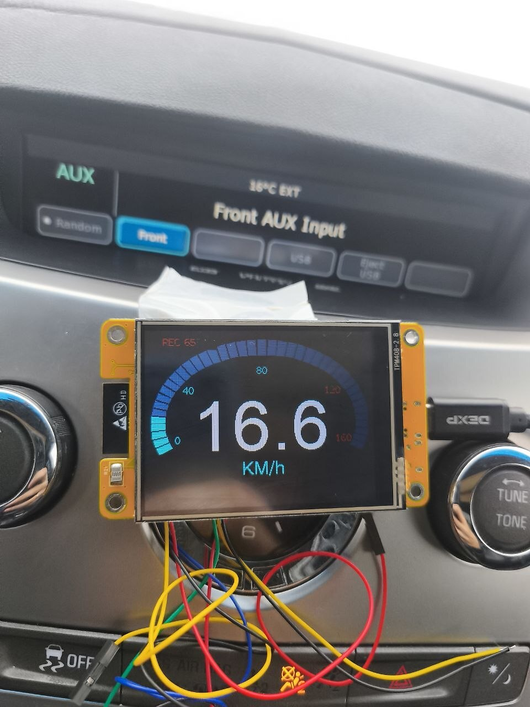

# MotoNav-CYD

Открытый GPS-спидометр, поездочный компьютер и GPX-логгер для мотоцикла на базе **ESP32-2432S028R (CYD)**.

> **Текущая версия: V1.0 Stable**  
> V1.0 основана на реально испытанной V0.9. Функциональная логика зафиксирована; релиз сосредоточен на стабильности, понятной установке и документации.

  

## Возможности

- крупный GPS-спидометр до 160 km/h с овальной шкалой;
- автоматическое переключение между поездочным компьютером и спидометром;
- пробег, средняя и максимальная скорость;
- общее время, время движения и остановок;
- ручная надёжная запись GPX на встроенную microSD;
- итоговый экран **RIDE SAVED**;
- индивидуальный CSV каждой поездки;
- индекс **RIDES_INDEX.CSV** и просмотр последних 20 поездок на CYD;
- живой экран GNSS: спутники, HDOP, возраст фикса, высота и координаты;
- фильтрация скачков скорости, дистанции и ошибочных GPX-точек;
- восстановление незакрытого GPX после внезапного отключения питания;
- дневная и ночная темы;
- km/h + km или mph + mi;
- жирные FreeSansBold-шрифты и карточный интерфейс;
- тест шкалы, pixel-art эндуро и трёхсекундная заставка **READY TO RIDE**.

## Экраны

| GNSS diagnostics | Ride history | Ride saved |
|---|---|---|
|  |  |  |

Дополнительные фотографии: [галерея V1.0](docs/PHOTOS.md).

## Быстрый старт

1. Скачайте **всю папку** [MotoNav_CYD_V1_0_Stable](firmware/motonav/MotoNav_CYD_V1_0_Stable).
2. Установите в Arduino IDE плату ESP32 и библиотеки:
   - TFT_eSPI;
   - TinyGPSPlus;
   - XPT2046_Touchscreen.
3. Настройте TFT_eSPI под ESP32-2432S028R/CYD.
4. Подключите TX GNSS-приёмника к **GPIO35**, землю к GND, питание — по паспорту модуля.
5. Вставьте microSD, отформатированную в FAT32.
6. Откройте [MotoNav_CYD_V1_0_Stable.ino](firmware/motonav/MotoNav_CYD_V1_0_Stable/MotoNav_CYD_V1_0_Stable.ino), выберите плату и загрузите прошивку.

Подробно: [Quick Start на русском и английском](docs/QUICK_START.md).

## Управление

| Действие | Результат |
|---|---|
| Короткое касание главного экрана | смена дневной/ночной темы |
| Удержание около 1,5 с на остановке | открыть меню |
| TRACK → START TRACK | начать новую запись |
| TRACK → FINISH | завершить и сохранить поездку |
| RIDES | посмотреть последние поездки |
| GNSS | открыть живую диагностику |
| SETTINGS | тема и единицы измерения |

При скорости от **5 km/h** меню, GNSS, история и итоговый экран закрываются автоматически. Из экранов **RIDES** и **RIDE SAVED** устройство сразу переходит на крупный спидометр.

## Запись и защита трека

- **WAIT FIX** — ожидание координат;
- **REC N** — запись активна, N — реально записанные точки;
- **SAVED N** — GPX и статистика сохранены;
- **SD ERROR** — ошибка карты или записи;
- данные сбрасываются на microSD каждые 2 секунды;
- при остановке во время записи появляется большая кнопка **STOP RECORD?**;
- после обрыва питания незакрытый GPX автоматически дополняется завершающими XML-тегами при следующем запуске.

Запуск и завершение записи намеренно оставлены ручными.

## Файлы на microSD

После поездок на карте появляются:

- `TRK_YYYYMMDD_HHMMSS.GPX` — маршрут;
- `TRK_YYYYMMDD_HHMMSS.CSV` — статистика конкретной поездки;
- `RIDES_INDEX.CSV` — быстрый индекс для экрана RIDES;
- `ACTIVE_TRACK.TXT` — временный служебный маркер, автоматически удаляемый после штатного завершения.

Описание колонок и примеры: [microSD и CSV](docs/STORAGE_FORMAT.md).

## Аппаратная платформа

- ESP32-2432S028R (CYD);
- ILI9341 320×240;
- XPT2046;
- встроенный слот microSD;
- внешний UART GNSS с NMEA, 9600 baud;
- проверено с GT-U12.

Подключение и пины: [hardware/README.md](hardware/README.md).

## Проверенная среда

- ESP32 Arduino Core 3.3.10;
- стандартная ESP32-библиотека SD;
- TFT_eSPI с включёнными GFXFF/FreeSansBold;
- CYD в горизонтальной ориентации, `setRotation(1)`.

Шрифты FreeSansBold уже подключаются через TFT_eSPI. Не добавляйте вручную повторные `#include FreeSansBold*.h` в скетч — это вызывает ошибку redefinition.

## Ограничения V1.0

- нет карты и навигационных подсказок;
- GPX нельзя просматривать или удалять на CYD;
- после восстановления оборванного GPX итоговый CSV не создаётся автоматически;
- незавершённая поездочная статистика после полного обесточивания не восстанавливается;
- точность зависит от GNSS-модуля, антенны, обзора неба и качества фикса.

## Версии

- **V1.0 Stable** — текущий стабильный релиз;
- **V0.9** — испытанная функциональная база V1.0;
- **V0.8** — предыдущая стабильная версия;
- **V0.7** — резервная версия надёжной GPX-записи.

История развития: [ROADMAP](docs/ROADMAP.md). Технические источники: [references](references/README.md).

## Лицензия и ответственность

Проект предназначен для самостоятельной сборки и испытаний. Перед установкой на мотоцикл обеспечьте защищённое питание, предохранитель, надёжные соединения и влагозащиту. Не используйте устройство так, чтобы оно отвлекало от управления.
