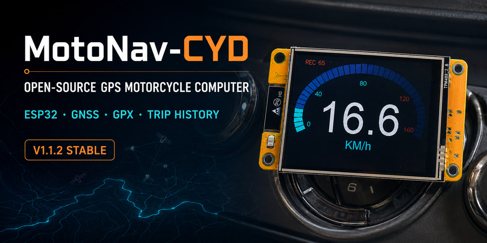
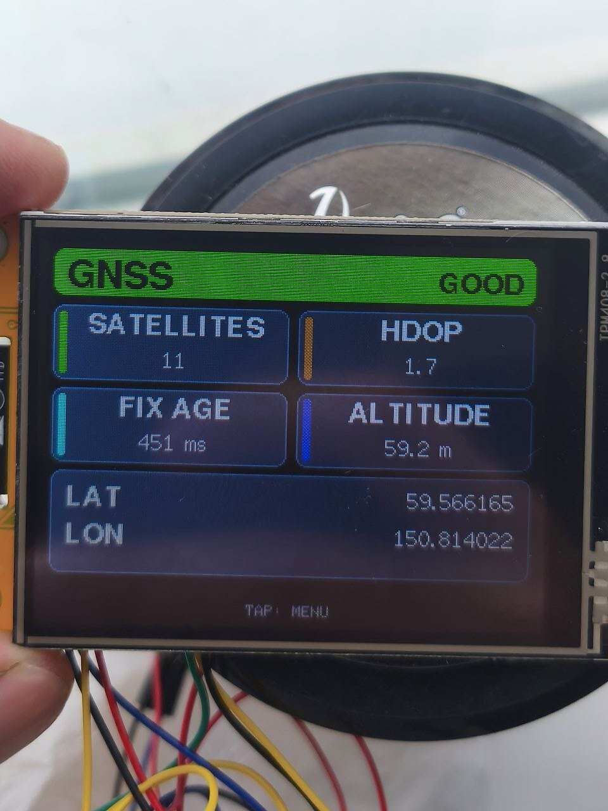
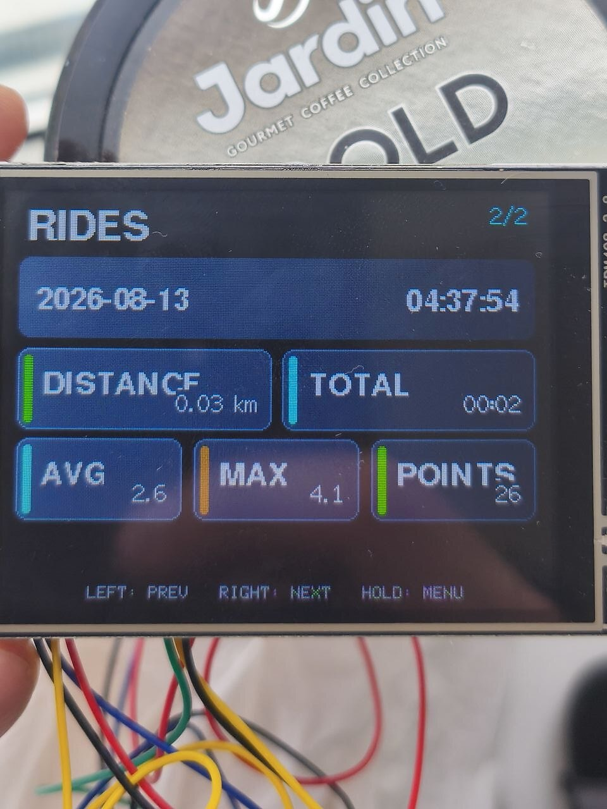
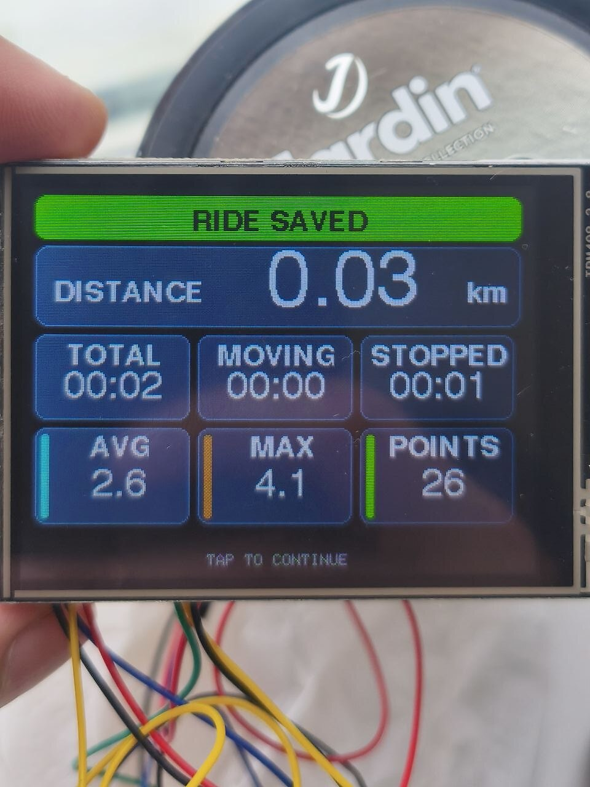
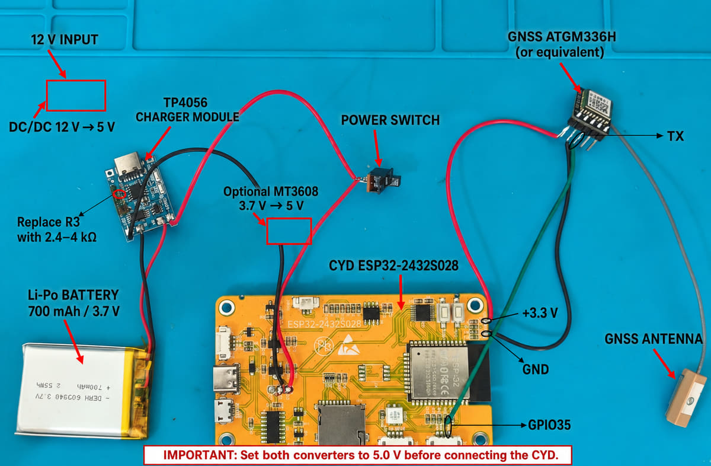

# MotoNav-CYD

**Open-source GPS motorcycle speedometer, trip computer and GPX logger for the ESP32-2432S028R Cheap Yellow Display.**

[English](README.md) · [Русский](README_RU.md) · [Quick Start](docs/QUICK_START.md) · [Hardware](hardware/README.md) · [Release notes](docs/RELEASE_NOTES_V1.1.2.md)

  

## Current stable release: V1.1.2

V1.1.2 keeps the field-tested V1.0 trip and logging logic and adds a smooth, fully buffered startup animation: a detailed pixel-art enduro motorcycle crosses the screen, performs a wheelie and transitions to the arcade-style **READY TO RIDE** title without visible full-screen flicker.

> **Download:** [MotoNav-CYD V1.1.2 Stable ZIP](dist/MotoNav_CYD_V1_1_2_Stable.zip) — ready to extract and open in Arduino IDE. You can also browse the [source folder](firmware/motonav/MotoNav_CYD_V1_1_2_Stable).

## Features

- large GNSS speedometer with a full-width 0–160 km/h oval gauge;
- automatic transition from trip computer to speedometer when movement begins;
- trip distance, average speed and maximum speed;
- total, moving and stopped time;
- reliable manual GPX recording to the built-in microSD slot;
- per-ride CSV statistics and `RIDES_INDEX.CSV`;
- on-device history for the latest 20 rides;
- live GNSS diagnostics: satellites, HDOP, fix age, altitude and coordinates;
- filtering of speed spikes, distance jumps and invalid GPX points;
- automatic repair of an unclosed GPX file after sudden power loss;
- day and night themes;
- km/h + km or mph + mi;
- readable FreeSansBold typography and card-based UI;
- buffered pixel-art startup animation and three-second **READY TO RIDE** screen.

## Real device screens

| GNSS diagnostics | Ride history | Ride saved |
|---|---|---|
|  |  |  |

More real-device photographs: [V1.0 photo gallery](docs/PHOTOS.md).

## Hardware

- ESP32-2432S028R / CYD;
- ILI9341 320×240 TFT;
- XPT2046 touchscreen;
- built-in microSD slot;
- external UART GNSS receiver producing NMEA at 9600 baud;
- tested with GT-U12 and ATGM336H-compatible wiring.

### GNSS connection

| GNSS module | CYD | Purpose |
|---|---:|---|
| TX | GPIO35 | NMEA input to ESP32 |
| GND | GND | Common ground |
| VCC | Per module specification | Check the required voltage first |
| RX | Not connected | V1.1.2 does not send GNSS commands |

  

Do not connect the CYD directly to a motorcycle 12 V system. Use a fused, protected and regulated 5 V supply. See the complete [hardware guide](hardware/README.md).

## Quick start

1. Download the complete [MotoNav_CYD_V1_1_2_Stable](firmware/motonav/MotoNav_CYD_V1_1_2_Stable) directory.
2. Install ESP32 board support in Arduino IDE.
3. Install `TFT_eSPI`, `TinyGPSPlus` and `XPT2046_Touchscreen`.
4. Configure TFT_eSPI for your ESP32-2432S028R revision.
5. Connect GNSS TX to GPIO35, connect GND and supply the GNSS module with its specified voltage.
6. Insert a FAT32-formatted microSD card.
7. Open `MotoNav_CYD_V1_1_2_Stable.ino`, compile and upload.

Full instructions in English and Russian: [Quick Start](docs/QUICK_START.md).

## Operation

| Action | Result |
|---|---|
| Short tap on the main screen | Toggle day/night theme |
| Hold for about 1.5 seconds while stopped | Open menu |
| `TRACK → START TRACK` | Start a new GPX recording |
| `TRACK → FINISH` | Finish and save the ride |
| `RIDES` | Browse recent ride summaries |
| `GNSS` | Open live GNSS diagnostics |
| `SETTINGS` | Change theme and units |

At 5 km/h or above, menus, GNSS diagnostics, ride history and the final ride screen close automatically and MotoNav switches to the large speedometer.

## Files written to microSD

- `TRK_YYYYMMDD_HHMMSS.GPX` — route track;
- `TRK_YYYYMMDD_HHMMSS.CSV` — statistics for one ride;
- `RIDES_INDEX.CSV` — compact index used by the on-device ride browser;
- `ACTIVE_TRACK.TXT` — temporary recovery marker removed after a normal finish.

Format details: [microSD and CSV documentation](docs/STORAGE_FORMAT.md).

Download real output samples recorded by MotoNav:

- [GPX track](docs/examples/TRK_20260815_001357.GPX);
- [per-ride CSV summary](docs/examples/TRK_20260815_001357.CSV);
- [ride history index](docs/examples/RIDES_INDEX.CSV).

Open GPX tracks in [QGIS](https://docs.qgis.org/latest/en/docs/user_manual/working_with_gps/plugins_gps.html), [Google Earth Pro](https://support.google.com/earth/answer/148095?hl=en), [GPXSee](https://gpxsee.org/) or [OsmAnd](https://osmand.net/docs/user/personal/tracks/manage-tracks/). A step-by-step QGIS example is included in the [storage documentation](docs/STORAGE_FORMAT.md#opening-a-gpx-track).

## Tested environment

- ESP32 Arduino Core 3.3.10;
- ESP32 built-in SD library;
- TFT_eSPI with GFXFF/FreeSansBold enabled;
- CYD landscape orientation with `setRotation(1)`.

FreeSansBold is already included through TFT_eSPI. Do not add duplicate `#include FreeSansBold*.h` directives to the sketch, because that causes redefinition errors.

## Limitations

- no maps, route guidance or turn-by-turn navigation;
- GPX files cannot yet be viewed or deleted on the CYD;
- recovery of an interrupted GPX does not automatically recreate its final CSV summary;
- unfinished trip statistics are not restored after complete power loss;
- accuracy depends on the GNSS receiver, antenna placement, sky visibility and fix quality.

## Versions

- **V1.1.2 Stable** — current stable release with the smooth buffered startup animation;
- **V1.0 Stable** — previous stable release and rollback option;
- **V0.9** — field-tested feature base for V1.0;
- **V0.8** — trip computer milestone;
- **V0.7** — reliable GPX recording milestone.

Development history: [Roadmap](docs/ROADMAP.md). Technical references: [references](references/README.md).

## Safety

This is a DIY project. Use a fuse, transient protection, reliable connectors, vibration isolation and a weather-resistant enclosure before installing it on a motorcycle. Mount the display where it does not obstruct controls or distract the rider.

## License

MotoNav-CYD is released under the [MIT License](LICENSE). You may use, modify and redistribute the project while retaining the copyright and license notice.
