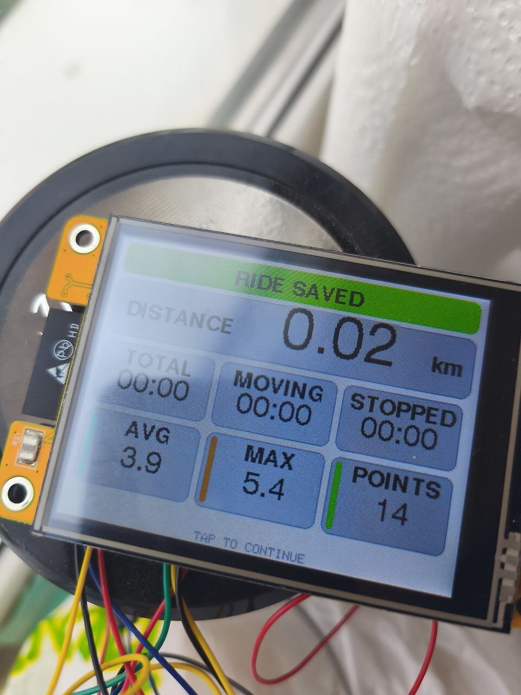
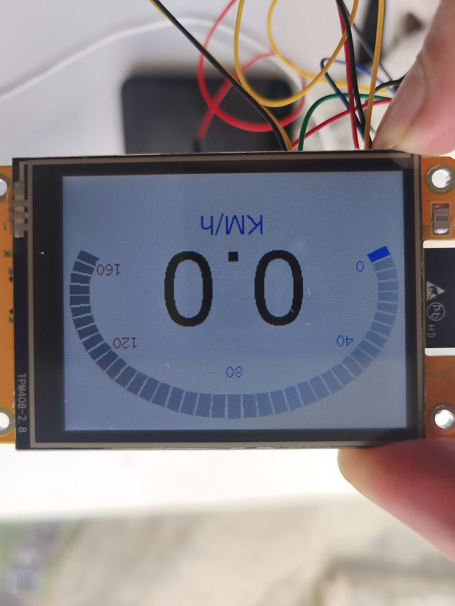

# Фотографии V1.0

Все фотографии сделаны на реальном ESP32-2432S028R. Выполнены только поворот, коррекция уровней и умеренное повышение резкости; содержимое экранов не перерисовывалось.

## Дорожное испытание

## GNSS-диагностика

## История поездок

## Итог поездки — ночная тема

## Итог поездки — дневная тема

## Спидометр — дневная тема

