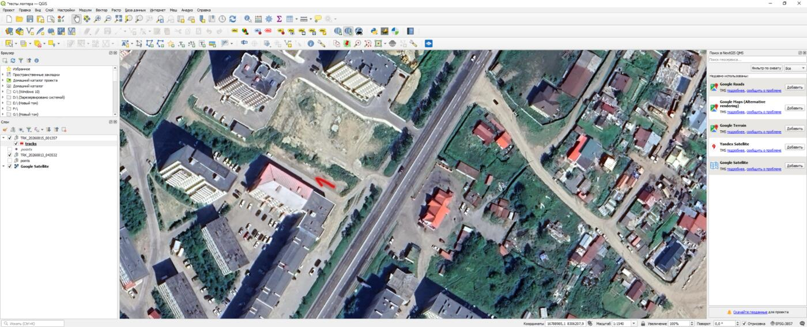

# Формат microSD и CSV

## Структура

```text
/
├── TRK_20260813_043754.GPX
├── TRK_20260813_043754.CSV
├── TRK_20260813_051022.GPX
├── TRK_20260813_051022.CSV
└── RIDES_INDEX.CSV
```

Во время активной записи временно присутствует `ACTIVE_TRACK.TXT`.

## GPX

Файл совместим с GPX 1.1 и содержит:

- широту и долготу каждой принятой точки;
- высоту, если она доступна;
- UTC-время;
- HDOP;
- количество спутников.

Реальный файл, записанный устройством: [TRK_20260815_001357.GPX](examples/TRK_20260815_001357.GPX).

## Как открыть GPX-трек

| Программа | Платформа | Для чего подходит |
|---|---|---|
| [QGIS](https://docs.qgis.org/latest/en/docs/user_manual/working_with_gps/plugins_gps.html) | Windows, macOS, Linux | подробный анализ трека, спутниковые подложки и работа со слоями |
| [Google Earth Pro](https://support.google.com/earth/answer/148095?hl=ru) | Windows, macOS, Linux | быстрый просмотр трека на спутниковой карте |
| [GPXSee](https://gpxsee.org/) | Windows, macOS, Linux | лёгкий и быстрый просмотрщик GPX без сложной настройки |
| [OsmAnd](https://osmand.net/docs/user/personal/tracks/manage-tracks/) | Android, iOS | просмотр трека и навигация по нему на телефоне |

### QGIS

1. Откройте **Слой → Добавить слой → Добавить векторный слой** либо перетащите GPX в окно QGIS.
2. Выберите файл `TRK_....GPX`.
3. В списке объектов отметьте **tracks** для линии маршрута и при необходимости **track_points** для отдельных GNSS-точек.
4. Добавьте картографическую подложку через **XYZ Tiles** или установленный каталог QuickMapServices.



> Важно: GPX хранит реальные координаты маршрута. Проверяйте содержимое файла перед публичной публикацией.

## CSV отдельной поездки

Заголовок:

```csv
version,date,time,gpx_file,distance_km,total_seconds,moving_seconds,stopped_seconds,average_kmh,maximum_kmh,gpx_points,completed
```

| Поле | Значение |
|---|---|
| version | версия формата CSV |
| date, time | дата и UTC-время GNSS |
| gpx_file | связанный GPX |
| distance_km | дистанция |
| total_seconds | полное время |
| moving_seconds | время движения |
| stopped_seconds | время остановок |
| average_kmh | средняя скорость в движении |
| maximum_kmh | максимальная отфильтрованная скорость |
| gpx_points | число записанных точек |
| completed | 1 для штатно завершённой поездки |

Пример: [TRK_20260815_001357.CSV](examples/TRK_20260815_001357.CSV).

## RIDES_INDEX.CSV

Содержит компактную строку каждой завершённой поездки. Прошивка читает последние 20 записей и показывает их на экране **RIDES**. Файл можно открыть напрямую в Excel, LibreOffice Calc или импортировать в другую систему аналитики.

Пример: [RIDES_INDEX.CSV](examples/RIDES_INDEX.CSV).

Не редактируйте индекс во время работы устройства. При ручном редактировании сохраняйте запятые как разделители и не меняйте порядок колонок.

## Example files

The [`docs/examples`](examples/) folder contains an actual GPX 1.1 track, its per-ride CSV summary and a multi-ride `RIDES_INDEX.CSV`. To open the GPX, use QGIS, Google Earth Pro, GPXSee or OsmAnd. The sample contains real coordinates and is intended for testing import and visualization workflows.

### Opening a GPX track

In QGIS, open **Layer → Add Layer → Add Vector Layer**, select the GPX file, then load **tracks** and optionally **track_points**. Add an XYZ or QuickMapServices basemap if you want the route over satellite imagery.
