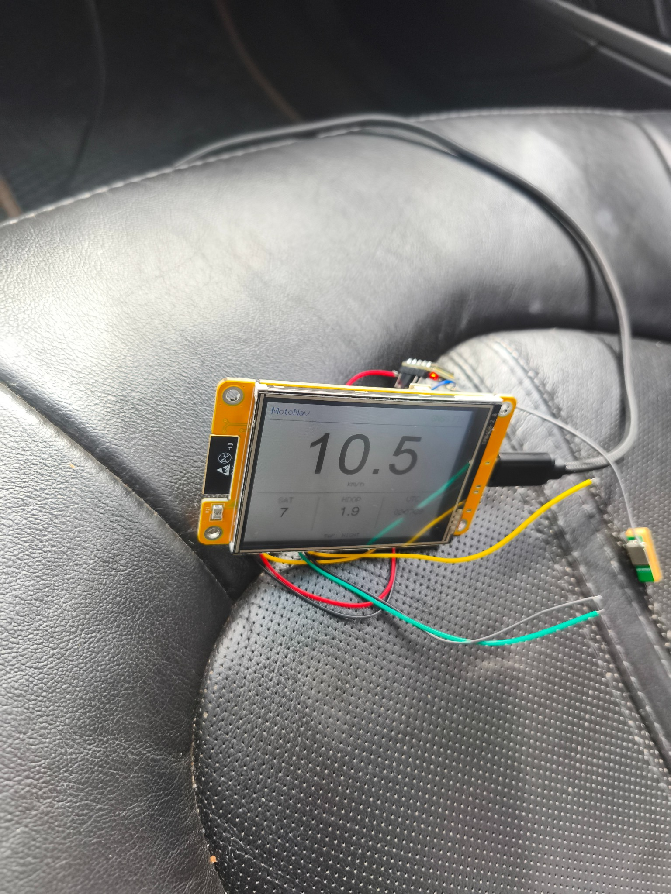

# V0.2 GPS Speedometer — результаты дорожного теста

Дата испытания: 2026-08-11  
Устройство: ESP32-2432S028R CYD  
Версия: V0.2 GPS Speedometer

## Результат

- дисплей работает;
- GNSS-приёмник получил валидную фиксацию;
- скорость в движении отображается крупно и читаемо;
- на снимке зафиксировано 10,5 км/ч;
- количество спутников: 8;
- HDOP: 1,00;
- подписи `km/h`, `SAT`, `HDOP`, `UTC` и подсказка темы не пересекаются;
- мерцание экрана после перехода на частичную буферизированную перерисовку не наблюдается;
- дневная тема работает.

## Фото

Итог: **V0.2 успешно прошла дорожный тест и готова к слиянию в `main`.**
